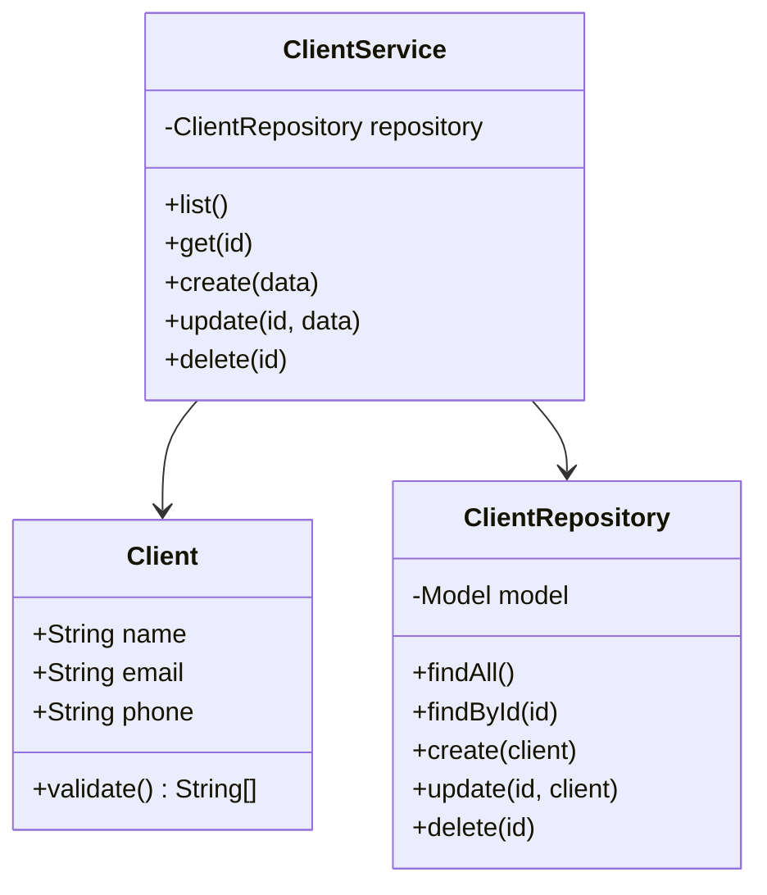
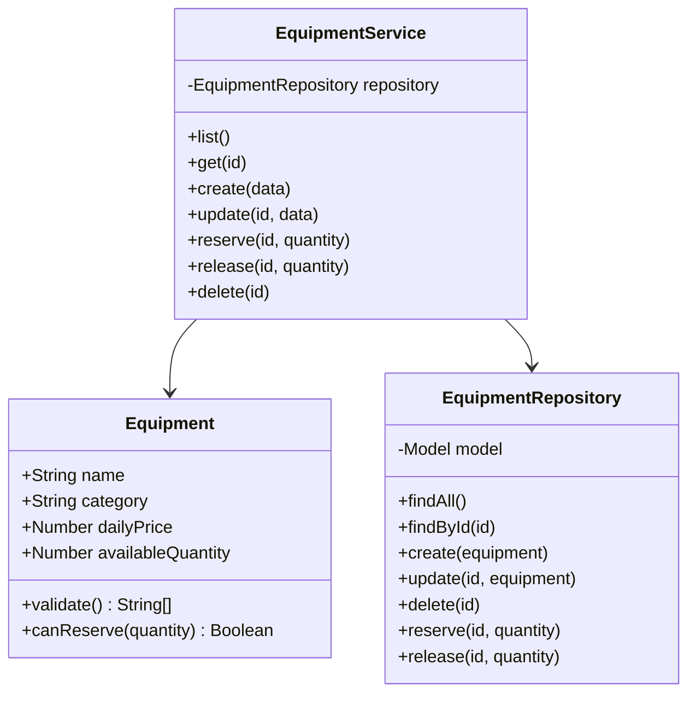
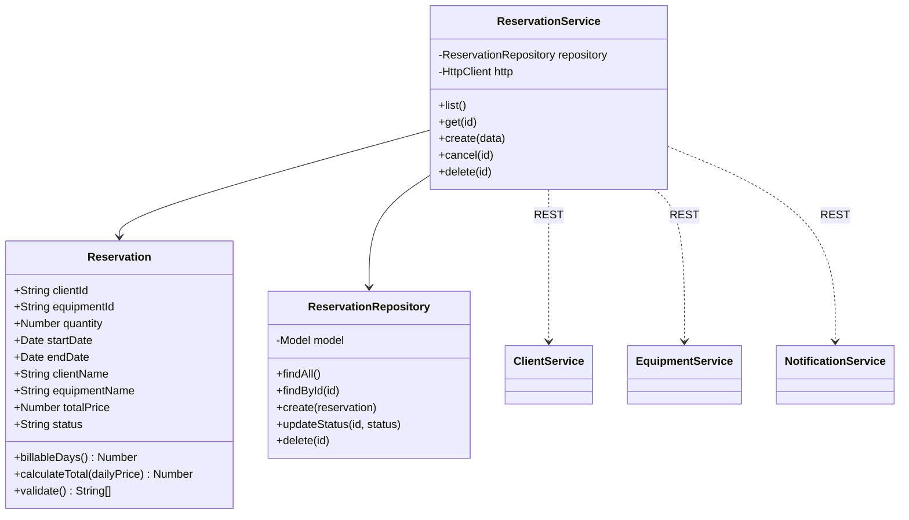
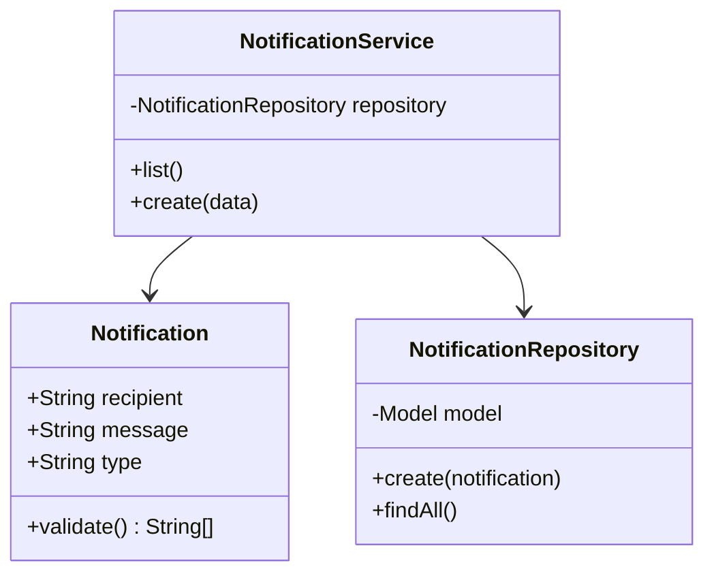

# Analyse et conception - Eventia Location

## 1. Exigences fonctionnelles

- EF-01 - Le système permet à un employé de créer, consulter, modifier et supprimer un client.
- EF-02 - Un client possède un nom, un courriel et un téléphone; le courriel est obligatoire et unique sans égard à la casse.
- EF-03 - Le système permet à un employé de créer, consulter, modifier et supprimer un matériel.
- EF-04 - Un matériel possède un nom, une catégorie, un prix quotidien positif ou nul et une quantité disponible entière positive ou nulle.
- EF-05 - Le système permet de créer une réservation avec un client, un matériel, une quantité et des dates de début et de fin.
- EF-06 - Une réservation est refusée si le client ou le matériel n'existe pas, si la quantité est inférieure à 1, si le stock est insuffisant ou si la date de fin précède la date de début.
- EF-07 - Le total est égal au nombre de jours inclusifs multiplié par la quantité et le prix quotidien.
- EF-08 - Une réservation confirmée conserve les noms du client et du matériel, le total et le statut `CONFIRMED`, et diminue le stock atomiquement.
- EF-09 - Une réservation confirmée peut être annulée une seule fois; son statut devient `CANCELLED` et le stock est remis.
- EF-10 - La confirmation et l'annulation créent une notification persistante; aucun courriel réel n'est envoyé.
- EF-11 - Les notifications sont consultables de la plus récente à la plus ancienne.
- EF-12 - Le frontend communique avec les services clients, matériel et réservations; seul un service backend appelle le service de notifications.
- EF-13 - Chaque service possède sa propre base MongoDB et expose une API REST avec les codes HTTP prescrits.
- EF-14 - L'application est accessible sans authentification dans cette version.
- EF-15 - En cas d'échec de persistance après une diminution de stock, le service de réservations tente de remettre le stock afin de préserver la cohérence.

### Ambiguïtés levées

- L'énoncé emploie à la fois `equipements` et `equipments`; `equipments` est retenu, car c'est le contrat utilisé par le frontend fourni et par les appels interservices.
- Le tableau indique `PUT /:id/cancel`, tandis que le frontend envoie `PATCH`; les deux méthodes sont acceptées.
- Les lignes CRUD répétées dans le tableau des réservations sont manifestement reprises du tableau du matériel. Les routes utiles de réservation sont la liste, la consultation, la création, l'annulation et la suppression.
- Une notification défaillante ne doit pas annuler une réservation déjà persistée et dont le stock est réservé; l'erreur est journalisée et l'opération principale demeure confirmée.

## 2. User stories et critères d'acceptation

### US-01 - Gérer les clients

En tant qu'employé, je veux gérer les fiches clients afin de conserver des coordonnées à jour.

- Étant donné des données valides, quand je crée ou modifie un client, alors la fiche retournée contient ces données.
- Si le courriel existe déjà, l'API répond 409.
- Quand je demande un identifiant absent, l'API répond 404.
- Quand je supprime un client existant, l'API répond 204.

### US-02 - Gérer le matériel

En tant que responsable de l'inventaire, je veux gérer le catalogue afin de connaître le matériel louable.

- Une création valide répond 201 et contient nom, catégorie, prix quotidien et quantité.
- Une valeur numérique négative ou une quantité non entière est refusée avec 400.
- Les opérations de consultation, modification et suppression respectent les codes 200, 404 et 204.

### US-03 - Réserver du matériel

En tant que préposé, je veux créer une réservation afin de confirmer une location sans double réservation.

- Le client et le matériel sont vérifiés auprès de leurs services.
- Une quantité inférieure à 1, des dates inversées, une ressource absente ou un stock insuffisant empêchent la création.
- Le stock est décrémenté atomiquement avant la persistance.
- Pour trois jours, deux unités à 25 $/jour, le total est 150 $.
- La réponse 201 contient les noms enrichis, le total et `CONFIRMED`.

### US-04 - Annuler une réservation

En tant que préposé, je veux annuler une réservation afin de remettre le matériel en disponibilité.

- Une réservation confirmée passe à `CANCELLED` et sa quantité est remise au stock.
- Une seconde annulation répond 409 et ne modifie pas le stock.
- Une réservation absente répond 404.

### US-05 - Consulter les notifications

En tant qu'employé, je veux consulter l'historique afin de retracer les confirmations et annulations.

- Une confirmation et une annulation tentent chacune de créer une notification.
- Le frontend ne crée jamais directement de notification.
- La liste est triée par `createdAt` décroissant.

## 3. Diagrammes UML

### Service clients

### Service matériel

### Service réservations

### Service notifications

## 4. Traçabilité

| Exigences | User story | Composants principaux |
|---|---|---|
| EF-01, EF-02 | US-01 | Client, ClientService, routes clients |
| EF-03, EF-04 | US-02 | Equipment, EquipmentService, routes matériel |
| EF-05 à EF-08, EF-15 | US-03 | Reservation, ReservationService, EquipmentRepository |
| EF-09 | US-04 | ReservationService.cancel, route cancel |
| EF-10 à EF-12 | US-05 | NotificationService, appels REST |
| EF-13, EF-14 | Toutes | server.js, configuration MongoDB et CORS |

## 5. Stratégie Git demandée

Le dépôt distant et les traces de collaboration doivent être réalisés par l'équipe : branches `main`, `develop`, `feature/client-service`, `feature/equipment-service`, `feature/reservation-service`, `feature/notification-service` et `docs/analyse-conception`; pull requests des branches de fonctionnalité vers `develop`, puis de `develop` vers `main`, avec révision par un autre membre. Cette livraison locale n'invente ni collaborateurs, ni commits individuels, ni pull requests.
